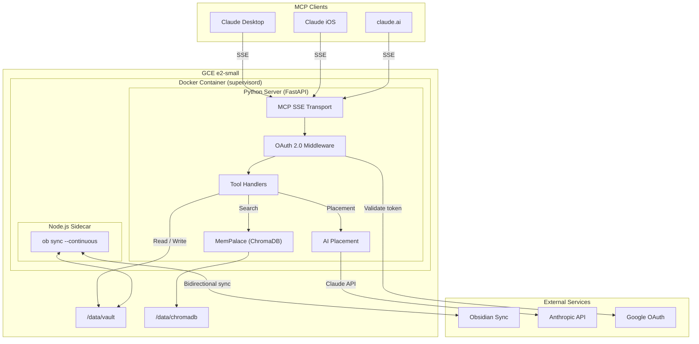
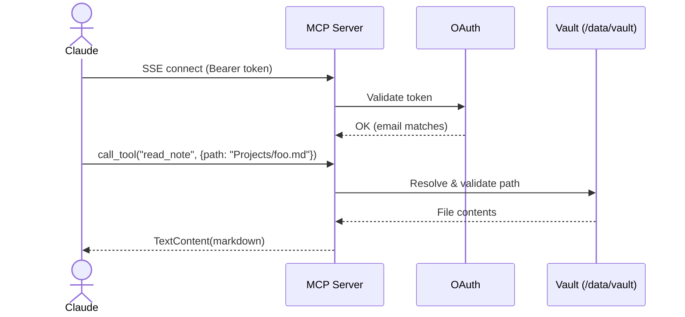
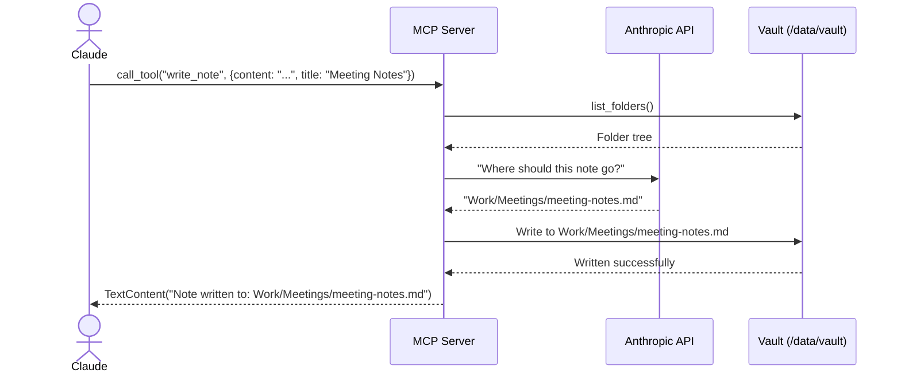

# Architecture

## Overview

ObsidianPalace is a single-container MCP server that provides AI clients bidirectional access to an Obsidian vault. It combines real-time vault synchronization via Obsidian Sync, semantic search via ChromaDB, and AI-assisted file placement via the Anthropic API.

The system is designed for a **single user** -- one Google account, one vault, one always-on VM.

## System Architecture

## Core Components

### 1. MCP SSE Transport

The entry point for all AI client connections. Implements the Model Context Protocol over Server-Sent Events, which is the transport required by Claude's Custom Connectors.

- **Endpoint**: `/mcp/sse` -- SSE connection for MCP messages
- **Endpoint**: `/mcp/messages/` -- POST endpoint for client-to-server messages
- **Auth**: Every SSE connection is validated via Google OAuth 2.0 before the stream is established

### 2. OAuth 2.0 Authentication

Single-user authentication using Google's OAuth 2.0 token validation. The server validates the Bearer token against Google's userinfo endpoint and checks that the email matches the configured allowed account.

### 3. Vault Operations

Path-safe read/write operations against the vault directory. All paths are resolved and validated to prevent directory traversal attacks before any file I/O occurs.

- **Read**: Returns the full markdown content of a note
- **Write**: Creates or overwrites a note, creating parent directories as needed
- **List**: Returns folders or note files at a given path

### 4. AI-Assisted Placement

When a note is written without an explicit path, the system calls Claude to determine where the note should be placed based on:

- The vault's current folder structure
- The note's title and content preview
- Existing organizational patterns

Falls back to `Inbox/` if no Anthropic API key is configured or the API call fails.

### 5. MemPalace (Semantic Search)

ChromaDB-backed semantic search over the vault contents. A file watcher monitors the vault directory for changes and re-indexes modified files to keep the search index current.

- **Index storage**: Persistent disk at `/data/chromadb`
- **Memory**: Requires 200-400 MB for a ~600 MB vault
- **Update strategy**: File watcher triggers re-indexing on file changes

### 6. Obsidian Sync Sidecar

A Node.js process running `ob sync --continuous` from the `obsidian-headless` CLI. This keeps the vault directory synchronized with Obsidian's cloud sync service bidirectionally.

- **Credentials**: Extracted from a one-time interactive `ob login`, stored in GCP Secret Manager, injected at container startup
- **Sync mode**: Bidirectional -- changes from MCP clients propagate back to Obsidian apps and vice versa

## Process Management

Three processes run inside a single container managed by **supervisord**:

| Process | Command | Role |
|---------|---------|------|
| `nginx` | `nginx -g "daemon off;"` | SSL termination + reverse proxy (443 → 8080) |
| `obsidian-sync` | `ob sync --continuous` | Keeps vault in sync with Obsidian Sync |
| `mcp-server` | `uvicorn obsidian_palace.app:app` | Serves MCP tools over SSE |

An `entrypoint.sh` script runs before supervisord to inject Obsidian Sync credentials and wait for the initial vault sync to pull at least one file. Supervisord ensures all three processes restart on failure and logs are captured.

## Data Flow

### Read a Note

### Write with AI Placement

## Infrastructure

| Resource | Spec | Purpose |
|----------|------|---------|
| **GCE Instance** | e2-small (2 vCPU, 2 GB RAM) | Application runtime |
| **Boot Disk** | 10 GB pd-standard, COS image | Container-Optimized OS |
| **Data Disk** | 20 GB pd-standard | Vault files + ChromaDB index |
| **Static IP** | Regional external IP | Stable DNS target |
| **Cloud DNS** | A record for `lifeos.thewintershadow.com` | Domain routing |
| **Secret Manager** | 5 secrets | OAuth, API keys, sync credentials |
| **SSL** | Let's Encrypt (certbot) | TLS termination |

Estimated monthly cost: **~$15** (e2-small + persistent disk + static IP).
