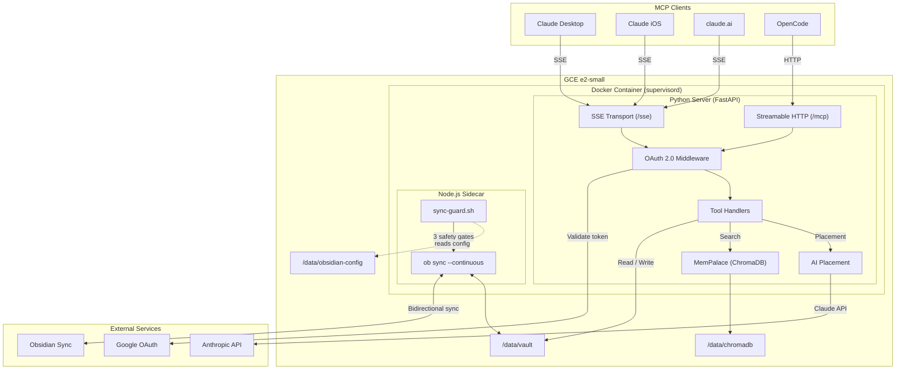
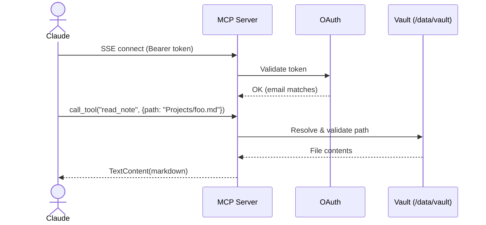
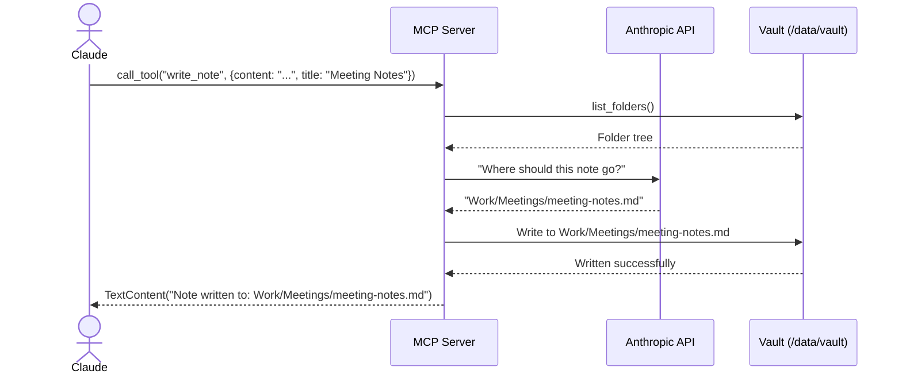

# Architecture

## Overview

ObsidianPalace is a single-container MCP server that provides AI clients bidirectional access to an Obsidian vault. It combines real-time vault synchronization via Obsidian Sync, semantic search via ChromaDB, and AI-assisted file placement via the Anthropic API.

The system is designed for a **single user** -- one Google account, one vault, one always-on VM.

## System Architecture

## Core Components

### 1. MCP Transport Layer

The entry point for all AI client connections. Implements the Model Context Protocol over two transports:

- **SSE Endpoint**: `/sse` -- Server-Sent Events connection for MCP messages (used by Claude Desktop, Claude Code, Claude iOS, claude.ai)
- **Streamable HTTP Endpoint**: `/mcp` -- Single POST endpoint for MCP messages (used by OpenCode)
- **Auth**: MCP OAuth 2.1 authentication with PKCE (see below)

### 2. MCP OAuth 2.1 Authentication

Implements the full [MCP OAuth 2.1 specification](https://modelcontextprotocol.io/specification/2025-03-26/basic/authorization) with Google as the identity provider. The server acts as its own Authorization Server and delegates user authentication to Google.

- **Discovery**: `/.well-known/oauth-protected-resource` (RFC 9728) and `/.well-known/oauth-authorization-server` (RFC 8414)
- **Dynamic client registration**: `/register` -- MCP clients register automatically on first connection
- **Authorization**: `/authorize` -- redirects to Google OAuth, then back to the server
- **Token exchange**: `/token` -- issues access/refresh tokens after Google authentication
- **Callback**: `/oauth2/callback` -- handles the Google OAuth redirect

The server validates that the authenticated Google account matches the configured `allowed_email`. Only one user can access the system.

### 3. Vault Operations

Path-safe read/write operations against the vault directory. All paths are resolved and validated to prevent directory traversal attacks before any file I/O occurs.

- **Read**: Returns the full markdown content of a note
- **Write**: Creates or overwrites a note, creating parent directories as needed
- **List**: Returns folders or note files at a given path

### 4. AI-Assisted Placement

When a note is written without an explicit path, the system calls Claude to determine where the note should be placed based on:

- The vault's current folder structure
- The note's title and content preview
- Existing organizational patterns

Falls back to `00_Inbox/` if no Anthropic API key is configured or the API call fails.

### 5. MemPalace (Semantic Search)

ChromaDB-backed semantic search over the vault contents. A file watcher monitors the vault directory for changes and re-indexes modified files to keep the search index current.

- **Index storage**: Persistent disk at `/data/chromadb`
- **Memory**: Requires 200-400 MB for a ~600 MB vault
- **Update strategy**: File watcher triggers re-indexing on file changes

### 6. Obsidian Sync Sidecar

A Node.js process running `ob sync --continuous` from the `obsidian-headless` CLI, gated by `sync-guard.sh`. This keeps the vault directory synchronized with Obsidian's cloud sync service bidirectionally.

- **Credentials**: `ob login` writes to `~/.obsidian-headless/auth_token`, symlinked to persistent disk at `/data/obsidian-config/headless/`
- **Sync config**: `ob sync-setup` writes to `~/.config/obsidian-headless/sync/<vault-id>/config.json`, symlinked to persistent disk at `/data/obsidian-config/config/`
- **Sync mode**: Bidirectional -- changes from MCP clients propagate back to Obsidian apps and vice versa
- **Safety**: `sync-guard.sh` runs three gates before starting sync: (1) auth_token exists, (2) sync config exists, (3) vault has >= 400 `.md` files

### 7. sync-guard.sh

A safety wrapper that runs before `ob sync` to prevent a misconfigured or empty vault from propagating deletions to all Obsidian Sync devices. Three gates:

1. **Credential gate**: Verifies `ob login` auth_token exists on persistent disk
2. **Sync config gate**: Verifies `ob sync-setup` config.json exists on persistent disk
3. **File count gate**: Counts `.md` files in the vault; blocks sync if below the safety threshold (default: 400)

If any gate fails, supervisord retries up to its configured limit, then marks the process FATAL. The MCP server continues running and serves whatever is on disk.

## Process Management

Three processes run inside a single container managed by **supervisord**:

| Process | Command | Role |
|---------|---------|------|
| `nginx` | `nginx -g "daemon off;"` | SSL termination + reverse proxy (443 -> 8080) |
| `obsidian-sync` | `sync-guard.sh` (which execs `ob sync --continuous`) | Keeps vault in sync with Obsidian Sync |
| `mcp-server` | `uvicorn obsidian_palace.app:app` | Serves MCP tools over SSE and Streamable HTTP |

An `entrypoint.sh` script runs before supervisord to:

1. **Symlink `ob` CLI config directories** to the persistent data disk so credentials and sync config survive container restarts:
    - `~/.obsidian-headless/` -> `/data/obsidian-config/headless/` (auth_token from `ob login`)
    - `~/.config/obsidian-headless/` -> `/data/obsidian-config/config/` (sync config from `ob sync-setup`)
2. **Migrate legacy config layout** if a previous version stored auth_token at a different path
3. **Start a background watcher** that creates a readiness flag once `.md` files exist in the vault
4. **Exec supervisord** to manage all three processes

## Data Flow

### Read a Note

### Write with AI Placement

## Infrastructure

| Resource | Spec | Purpose |
|----------|------|---------|
| **GCE Instance** | e2-small (2 vCPU, 2 GB RAM) | Application runtime |
| **Boot Disk** | 10 GB pd-standard, COS image | Container-Optimized OS |
| **Data Disk** | 20 GB pd-standard | Vault files + ChromaDB index |
| **Static IP** | Regional external IP | Stable DNS target |
| **DNS** | A record at domain registrar | Points domain to static IP |
| **Secret Manager** | 4 secrets | OAuth, API keys |
| **SSL** | Let's Encrypt (certbot) | TLS termination |

Estimated monthly cost: **~$15** (e2-small + persistent disk + static IP).
