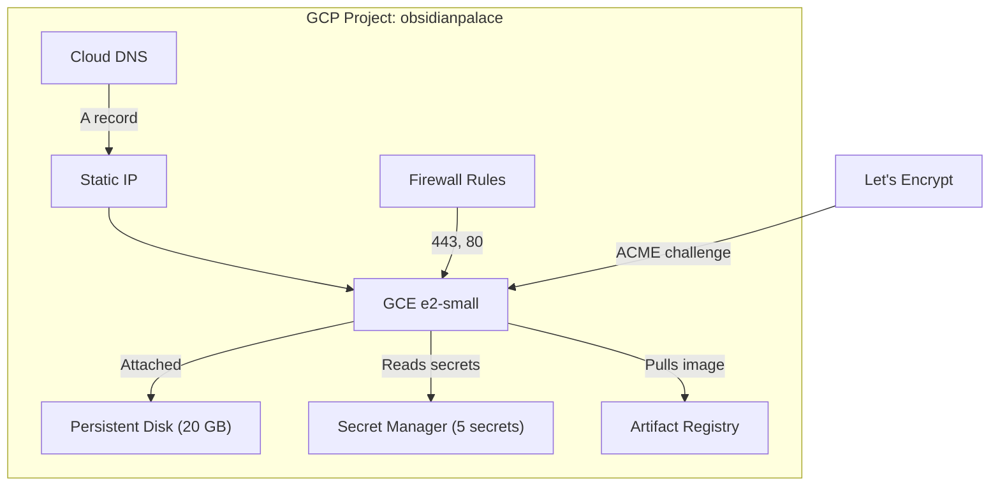

# Deployment

ObsidianPalace runs on a single GCE e2-small instance (~$15/month). The entire infrastructure is managed by Terraform with state stored in Terraform Cloud.

## Prerequisites

- A **GCP project** with billing enabled
- **Terraform** >= 1.5 with a [Terraform Cloud](https://app.terraform.io/) account
- A **Google OAuth 2.0** client ID and secret (for authentication)
- An **Anthropic API key** (for AI-assisted note placement)
- **Obsidian Sync** credentials (for vault synchronization)
- A **domain** pointed at GCP Cloud DNS name servers

## Step 1: Obsidian Sync Credentials

The `ob login` command is interactive and must be run once locally:

```bash
# Install obsidian-headless
npm install -g obsidian-headless

# Login (interactive -- enter your Obsidian account credentials)
ob login

# The credential file is saved to ~/.config/obsidian-headless/
# Base64-encode it for Secret Manager
base64 < ~/.config/obsidian-headless/credentials.json
```

Save the base64-encoded output -- you'll set it as a Terraform Cloud variable.

## Step 2: Docker Image

Build and push the container image to GCP Artifact Registry. The Artifact Registry repository is provisioned by Terraform, so run `terraform apply` first (Step 4), then come back to push the image:

```bash
# Authenticate Docker to Artifact Registry
gcloud auth configure-docker us-central1-docker.pkg.dev

# Build and push
docker build -t us-central1-docker.pkg.dev/obsidianpalace/obsidian-palace/obsidian-palace:latest .
docker push us-central1-docker.pkg.dev/obsidianpalace/obsidian-palace/obsidian-palace:latest
```

Alternatively, push to `main` and let the CI workflow build and push automatically.

## Step 3: Terraform Cloud Variables

Create the workspace `obsidian-palace` in org `TheWinterShadow` on [Terraform Cloud](https://app.terraform.io/) and set these workspace variables:

| Variable | Category | Sensitive | Description |
|----------|----------|-----------|-------------|
| `container_image` | Terraform | No | Full image URI (e.g., `us-central1-docker.pkg.dev/obsidianpalace/obsidian-palace/server:latest`) |
| `google_oauth_client_id` | Terraform | Yes | Google OAuth 2.0 client ID |
| `google_oauth_client_secret` | Terraform | Yes | Google OAuth 2.0 client secret |
| `allowed_email` | Terraform | Yes | Your Google account email |
| `anthropic_api_key` | Terraform | Yes | Anthropic API key |
| `obsidian_sync_credentials` | Terraform | Yes | Base64-encoded Obsidian Sync credential file |

Optional variables:

| Variable | Default | Description |
|----------|---------|-------------|
| `allowed_ssh_cidrs` | `[]` | CIDR blocks for SSH access (e.g., `["1.2.3.4/32"]`) |
| `allowed_https_cidrs` | `[]` | Additional HTTPS CIDR restrictions (empty = allow all, rely on OAuth) |

## Step 4: Deploy

```bash
cd terraform/environments/prod
terraform init
terraform plan
terraform apply
```

## Step 5: DNS Configuration

After the first `terraform apply`, the output includes `dns_name_servers`. Update your domain registrar's NS records to point at these name servers:

```bash
terraform output dns_name_servers
```

!!! note "DNS propagation"
    NS record changes can take up to 48 hours to propagate, though they typically complete within a few hours.

## Step 6: Verify

Once DNS propagates and Let's Encrypt issues a certificate (handled automatically by the startup script):

```bash
# Health check
curl https://lifeos.thewintershadow.com/health

# Expected response:
# {"status": "ok", "version": "0.1.0"}
```

The Swagger API docs are available at:

- **Swagger UI**: `https://lifeos.thewintershadow.com/docs`
- **ReDoc**: `https://lifeos.thewintershadow.com/redoc`
- **OpenAPI JSON**: `https://lifeos.thewintershadow.com/openapi.json`

## Infrastructure Overview



## Cost Estimate

| Resource | Monthly Cost |
|----------|-------------|
| GCE e2-small (always-on) | ~$13.00 |
| Persistent disk (20 GB pd-standard) | ~$0.80 |
| Static IP (in use) | ~$0.00 |
| Cloud DNS (managed zone) | ~$0.20 |
| Secret Manager (5 secrets) | ~$0.00 |
| **Total** | **~$14.00** |
