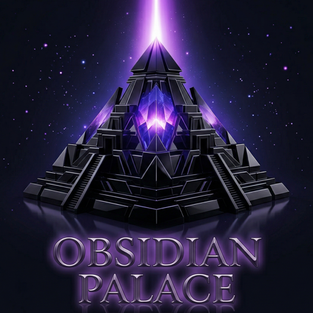
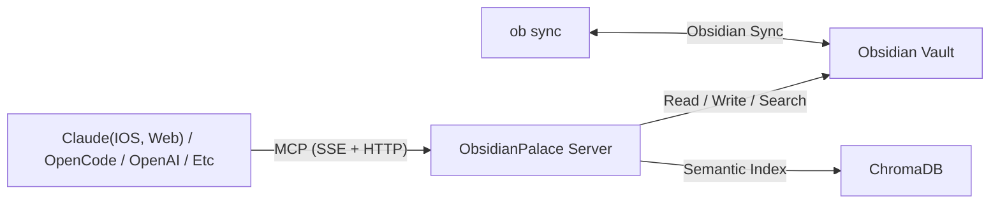

<div align="center" markdown>

{ width="200" }

# Obsidian Palace

**MCP server for Obsidian vaults** -- bidirectional sync, semantic search, and AI-assisted file placement, exposed over the Model Context Protocol.

[](https://www.python.org/downloads/)
[](https://github.com/TheWinterShadow/ObsidianPalace/blob/main/LICENSE)
[](https://fastapi.tiangolo.com/)
[](https://www.terraform.io/)
[](https://modelcontextprotocol.io/)

</div>

---

<div class="grid cards" markdown>

-   :material-magnify: **Semantic search**

    ---

    Search your entire Obsidian vault using natural language. Powered by MemPalace and ChromaDB for fast, accurate results.

-   :material-sync: **Bidirectional sync**

    ---

    Read and write notes through MCP tools. Vault stays in sync with Obsidian Sync via the `obsidian-headless` sidecar.

-   :material-brain: **AI-assisted placement**

    ---

    Write a note without specifying a path -- Claude analyzes your vault structure and places the file where it belongs.

-   :material-shield-lock: **Secure by default**

    ---

    Google OAuth 2.0 authentication. Single-user system locked to one Google account. All secrets in GCP Secret Manager.

-   :material-server-network: **Deploy your own**

    ---

    Full setup guide to deploy your own instance on GCE with Terraform. ~$15/month, all infrastructure as code.

</div>

---

## How it works

ObsidianPalace runs as a single Docker container with two processes managed by supervisord:

1. **Node.js sidecar** -- `ob sync --continuous` keeps the vault synchronized with Obsidian Sync
2. **Python MCP server** -- FastAPI + MCP SDK exposes vault tools over SSE transport

AI clients like Claude Desktop, Claude iOS, and claude.ai connect via the Model Context Protocol and get full read/write/search access to your vault.



---

## MCP tools

ObsidianPalace exposes five tools to MCP clients:

| Tool | Description |
|------|-------------|
| `search_vault` | Semantic search across the vault using natural language |
| `read_note` | Read the full content of a note by path |
| `write_note` | Write or update a note (with optional AI placement) |
| `list_folders` | Browse the vault's folder structure |
| `list_notes` | List note files in a folder |

See the [MCP Tools](mcp-tools/index.md) page for detailed schemas and examples.

---

## Quick start

=== ":simple-docker: Docker"

    ```bash title="Run locally with Docker"
    # Build the image
    docker build -t obsidian-palace .

    # Run with a local vault directory
    docker run -p 8080:8080 \
      -v ~/obsidian-vault:/data/vault \
      -e OBSIDIAN_PALACE_ALLOWED_EMAIL="you@gmail.com" \
      obsidian-palace
    ```

=== ":simple-googlecloud: GCE (Production)"

    ```bash title="Deploy with Terraform"
    cd terraform/environments/prod
    terraform init
    terraform apply
    ```

---

## Where to go next

<div class="grid cards" markdown>

-   [**:material-information-outline: Architecture**](architecture/index.md){ .md-button }

    System design, components, and data flow.

-   [**:material-clipboard-check-outline: Setup Guide**](setup/index.md){ .md-button .md-button--primary }

    Deploy your own instance on GCE with Terraform.

-   [**:material-tools: MCP Tools**](mcp-tools/index.md){ .md-button }

    Detailed reference for all five MCP tools.

-   [**:material-rocket-launch: Operations**](deployment/index.md){ .md-button }

    CI/CD, monitoring, maintenance, and troubleshooting.

-   [**:material-code-tags: API Reference**](api/index.md){ .md-button }

    Swagger UI, OpenAPI spec, and Python module docs.

</div>
